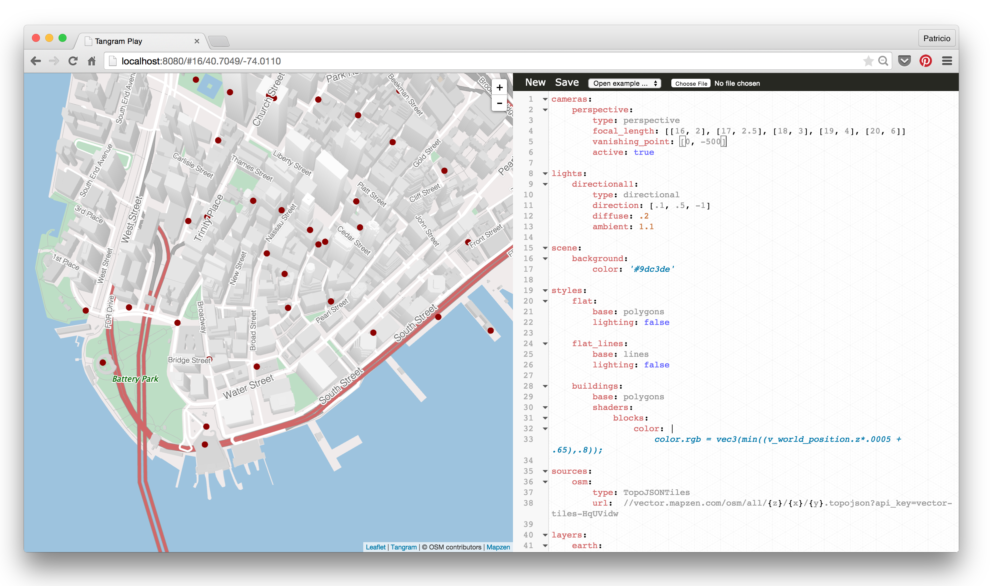

Style Editor for Tangram Styles

## Querry string API

* ```lines=[number]/[number-number]```: you highlight a line or a range of lines. Example ```lines=10-12```.

* ```foldLevel=[indentation-level]```: fold the code acording to the indentation level. Example ```foldLevel=0```.

* ```style=[url.yaml]```: load a specific ```.yaml``` file using a valid url

## Keys

* ```Ctrl``` + ```[number]```: Fold indentation level ```[number]```
* ```Alt``` + ```F```: fold/unfold line
* ```Ctrl``` + ```F```: Search
