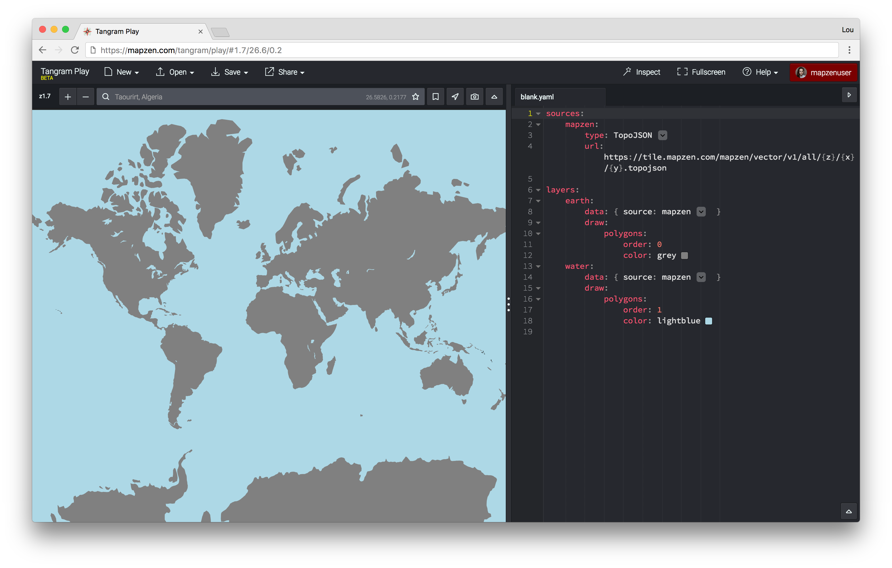

Style Editor for Tangram Styles

## Query string API

* ```lines=[number]/[number-number]```: you highlight a line or a range of lines. Example ```lines=10-12```.

* ```style=[url.yaml]```: load a specific ```.yaml``` file using a valid url

## Keys

* ```Ctrl``` + ```[number]```: Fold indentation level ```[number]```
* ```Alt``` + ```F```: fold/unfold line
* ```Alt``` + ```P```: screenshot of the map

Sublime-like hotkeys
* ```Ctrl``` + ```F```: Search
* ```Ctrl``` + ```D```: Select next occurrence
* ```Alt``` + ```ArrowKeys```: move word by word
* ```Shift``` + ```ArrowKeys```: Select character by character
* ```Shift``` + ```Alt``` + ```ArrowKeys```: Select word by word

## Local installation / build process

Clone this repository, then, in this repository's root directory, run the following:

```sh
npm install  # Installs Node modules dependencies
gulp js css  # Builds Javascript and CSS files to /build
```

Typing `gulp` by itself runs the Javascript and CSS build scripts, and additionally starts a watcher that will rebuild each time the source files are changed. If a [LiveReload](http://livereload.com/) server is active, it will also publish stylesheet updates to LiveReload. You may safely kill the gulp process at any time by hitting Ctrl-C.

Tangram-Play is a static site, and can be viewed by any static fileserver, such as Python's [SimpleHTTPServer](https://docs.python.org/2/library/simplehttpserver.html) or Node's [http-server module](https://www.npmjs.com/package/http-server).

Compiled files in the `build/` directory are committed and published to GitHub so that [GitHub Pages](https://pages.github.com/) have access to it. Generally, I try not to include the compiled files with every commit until something is ready to go live. Then I make one commit that is just the compiled files. This makes it easier to back out of strange merge conflicts and keeps the history from getting too complicated.
